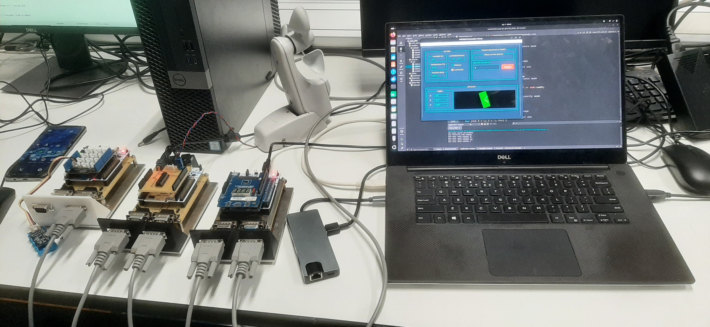
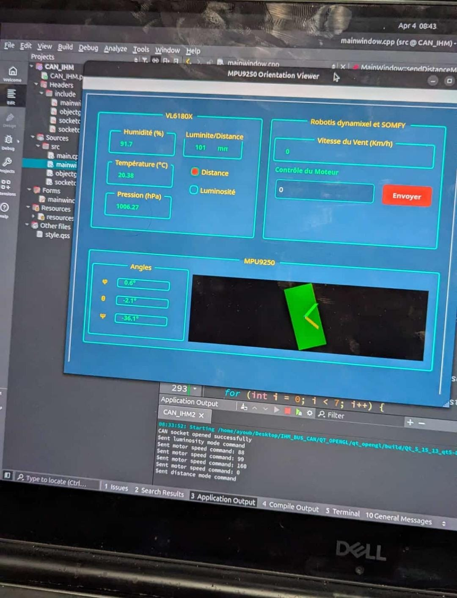

# Projet CAN Bus - Système Multi-Capteurs

## Architecture du système
Le système se compose de trois cartes STM32 distinctes, chacune exécutant un programme spécifique :

1. **Carte 1 - Capteurs environnementaux (ID_1)** :
   - Capteur VL6180X (distance et luminosité)
   - Capteur LPS22HB (pression atmosphérique)
   - Capteur HTS221 (humidité et température)

2. **Carte 2 - MPU9250 Centrale inertielle (ID_2)** :
   - Accéléromètre
   - Gyroscope
   - Magnétomètre
   - Calcul d'orientation (angles d'Euler - phi, theta, psi)

3. **Carte 3 - Moteur et anémomètre (ID_3)** :
   - Moteur Dynamixel (contrôle de vitesse)
   - Anémomètre (mesure de la vitesse du vent)

## Code source pour chaque carte

Les codes spécifiques développés pour chaque carte sont disponibles dans les fichiers suivants :

- Carte environnementale (ID_1) : Inclus dans le fichier rescapt/main.c du projet principal
- Carte MPU9250 (ID_2) : Disponible dans le fichier MPU9250.c
- Carte Anémomètre/Moteur (ID_3) : Disponible dans le fichier Anemometer.c

Chaque fichier contient le code complet et optimisé pour la carte correspondante.

## Approche méthodologique

L'approche pour réaliser ce projet a été basée sur un développement progressif :

### 1. Développement et test individuel des cartes

Chaque carte a été développée et testée individuellement :
- Création d'un programme spécifique adapté aux capteurs et actionneurs de chaque carte
- Vérification du fonctionnement correct de chaque capteur et du traitement des données
- Implémentation de la communication CAN sur chaque carte et test de l'envoi des messages

L'architecture distribuée avec des programmes spécialisés sur chaque carte a été maintenue plutôt que de combiner tous les codes en un seul programme.

### 2. Intégration des cartes

Une fois le fonctionnement individuel validé :
- Connexion des trois cartes sur le même bus CAN
- Vérification de la configuration correcte des identifiants CAN pour éviter les conflits
- Utilisation de filtres CAN pour que chaque carte reçoive uniquement les messages pertinents

### 3. Optimisation de la communication

Face aux problèmes de surcharge du bus et de latence élevée lors de la connexion de toutes les cartes, le code de chaque carte a été optimisé :

- **Réduction du trafic CAN** :
  - Implémentation d'envoi conditionnel (uniquement en cas de changement significatif des valeurs)
  - Ajout de temporisations différentes selon l'importance des données
  - Ajout de compteurs de messages pour détecter les pertes de paquets

- **Amélioration des performances** :
  - Optimisation des fréquences d'échantillonnage
  - Ajout de délais entre les transmissions pour éviter la congestion
  - Amélioration des algorithmes de filtrage pour la stabilité des données

### 4. Développement de l'interface Qt

Une interface utilisateur Qt a été développée pour :
- Recevoir et afficher les données de tous les capteurs
- Permettre le contrôle du moteur Dynamixel
- Afficher l'orientation 3D du MPU9250
- Permettre de changer le mode du capteur VL6180X (distance ou luminosité)

## Détails de l'implémentation

### Communication CAN

La communication CAN a été implémentée avec les identifiants suivants :
- **0x01** - Carte 1 (commandes pour capteurs environnementaux)
- **0x22** - Données de luminosité du VL6180X
- **0x23** - Données de distance du VL6180X
- **0x24** - Données de pression atmosphérique
- **0x25** - Données de température
- **0x26** - Données d'humidité
- **0x02** - Carte 2 (commandes pour MPU9250)
- **0x95** - Données d'orientation du MPU9250
- **0x03** - Carte 3 (commandes pour moteur/anémomètre)
- **0x85** - Données de l'anémomètre

### Format des messages

Pour assurer la compatibilité entre les cartes et l'interface Qt, des formats de messages standards ont été définis :

- **Messages de capteurs environnementaux** :
  - Distance : 2 octets (valeur en mm)
  - Luminosité : 4 octets (valeur en lux)
  - Pression : 4 octets (valeur * 100 en hPa)
  - Température : 4 octets (valeur * 100 en °C)
  - Humidité : 4 octets (valeur * 100 en %)

- **Messages d'orientation** :
  - 6 octets (2 octets par angle, valeurs * 100 en degrés)

- **Messages d'anémomètre** :
  - 2 octets (vitesse du vent en km/h)

- **Messages de commande** :
  - Mode VL6180X : ID 0x01, data[7] = 0x11 (luminosité) ou 0x12 (distance)
  - Contrôle moteur : ID 0x03, data[0] = 0x30 (ON/OFF) ou 0x40 (vitesse manuelle)

## Résultats et conclusions

Grâce à l'approche modulaire et à l'optimisation de la communication CAN, le projet a abouti à un système distribué de capteurs et d'actionneurs fonctionnant en temps réel. L'interface Qt permet de visualiser toutes les données simultanément et de contrôler les différents éléments du système.

Les principales difficultés rencontrées et surmontées :
- La gestion de la charge du bus CAN avec plusieurs capteurs envoyant des données à haute fréquence
- La synchronisation des différentes cartes pour obtenir des mesures cohérentes
- L'optimisation du code pour réduire la latence et améliorer la réactivité du système

### Compilation et déploiement
1. Ouvrir chaque projet dans STM32CubeIDE
2. Compiler et téléverser le code approprié sur chaque carte
3. Connecter les cartes au bus CAN
4. Compiler et exécuter l'interface Qt

### Utilisation
1. Lancer l'interface Qt
2. Observer les données des capteurs en temps réel
3. Utiliser les contrôles pour modifier le mode du capteur VL6180X
4. Contrôler la vitesse du moteur Dynamixel manuellement

## Screenshots:

